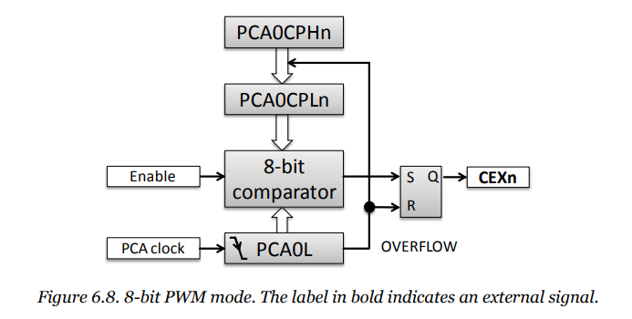
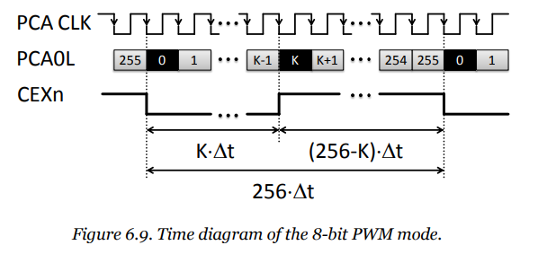
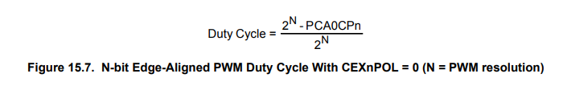
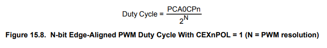

# Using the PCA as a PWM source

Altough the PCA has many different uses, like simply functioning as a counter (hence the counter array name) in a customizable way (hence the programmable name), as a watchdog timer and more, we are going to focus on the PWM output aspect of it.

*Block diagram of the PCA functioning as a PWM signal source*

The following picture demonstrates how the output is formulated.

*K* is the reload value of **PCA0L**. This value determines how long **CEXn** is high/low. (When there is an overflow, **CEXn** changes to the opposite value.)
In general the following equation describes the frequency of the PWM output: *f_PWM=f_CLK/(2^K)*

The duty cycle determines that how much is high under one output cycle. It depends on the resolution(**N**), the compare value (**PCA0CPn**) and the polarity of the output (**CEXnPOL**).

*Calculation of the duty cycle*
 

Due to architectural design, all pins must be skipped by the crossbar and set to ground. (Well, the do not *have* to be done so, but this enables us to use all other pins only where necessary with the extension board.) We skip all the pins, so the first available free pin is used for channel 0 of the PCA output, the 2. available free pin is used for channel 1 of the PCA output and the 3. available free pin is used for channel 2 of the PCA output. Thus, for instance if we would like to provide the output for the onboard LED (**P1.4**) by channel 0, we must skip all port up to **P1.3**, so **PCA0_CEX0**'s output is the onboard LED's input.

The following are the options for configuring the PCA channel:

- *Capture/compare flag interrupt*: Enables interrupt for when a capture/compare happens (interrupt flag is generate) on a given channel.
- *Enable comparator clear for **CEX**:* If enabled, the analog comparator can delete the **CEXn** output.
- *Match function*: Enables interrupt.
- *PCA alignment*:
  - *Edge-aligned PWM*: The output changes when the counter overflows.
  - *Center-aligned PWM*: *TODO: add explenation for Center-aligned PWM*

In PCA in PWM mode can either be an 8~11 bit PWM or 16 bit PWM. *TODO: add explenation for both PWM modes*
